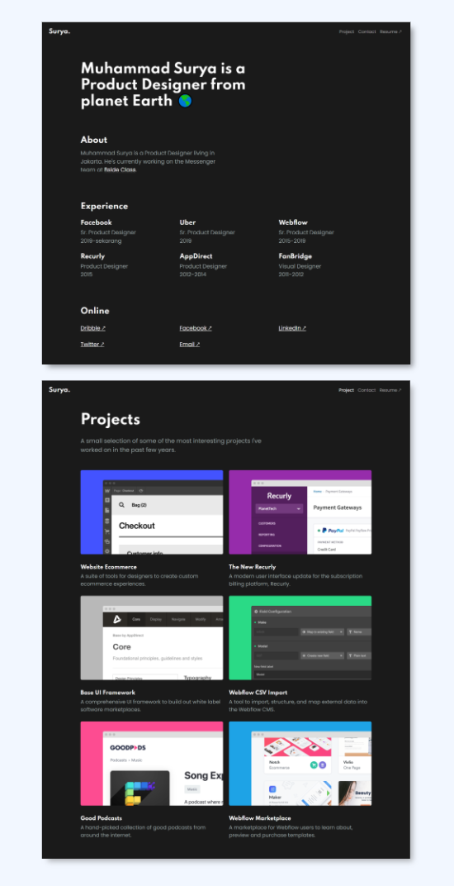

 
  

  &#xa0;

  <a href="https://dark-portfolio.netlify.app/">Demo</a>

<h1 align="center">Dark Portfolio</h1>

  

  

  

  

  <!--  -->

  <!--  -->

  

<!-- Status -->

<!-- <h4 align="center"> 
	🚧  Porto #1 🚀 Under construction...  🚧
</h4> 

 -->

  <a href="#dart-about">About</a> &#xa0; | &#xa0; 
  <a href="#rocket-technologies">Technologies</a> &#xa0; | &#xa0;
  <a href="#memo-license">License</a> &#xa0; | &#xa0;
  <a href="https://github.com/suryamsj" target="_blank">Author</a>

 

## :dart: About ##

Dark Portfolio adalah template portfolio gratis, sekali lagi ini hanya template jadi tidak dinamis.

## :rocket: Technologies ##

Teknologi yang digunakan pada project ini:

- [SCSS](https://nodejs.org/en/)
- [Bootstrap 5](https://pt-br.reactjs.org/)

## :memo: License ##

This project is under license from MIT. For more details, see the [LICENSE](LICENSE) file.

Made with :heart: by <a href="https://github.com/suryamsj" target="_blank">Muhammad Surya Jayadiprana</a>

&#xa0;

<a href="#top">Back to top</a>
